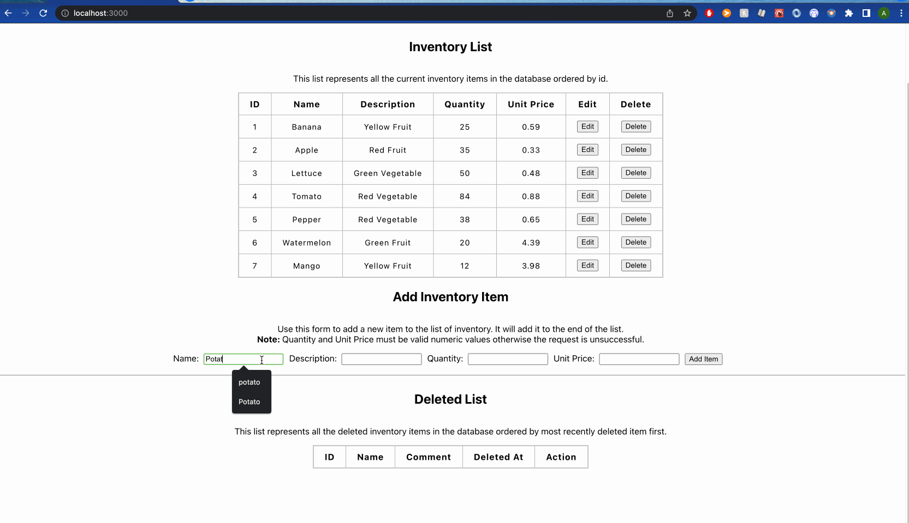

# Shopify Inventory Application- Fall 2022

An inventory tracking application for shopify's backend developer intern application.

# Demo



## Dev Dependencies

You will need teh following dependencies for best results:

- Node >= 14
- Express 4.16.4
- React 18.1.0
- PostgreSQL 14.2

## How To Run

Clone this repository locally. Make sure you have the above dependencies installed.

You will first need to set up your local environment. To do so set you environmental variables first. Use the ```.env.example``` file as an example. Postgres defaults are:

- port = `5432`
- host = `localhost`

- recommended database name: inventory

Once you have an instance of your database running locally and have added your environmental variables, you can populate the database using the seed files in ```server/db/seeds/inventory.sql```. It will create the table you need to run the application properly. Another option is to do it manually when the application is running. 

Once you have your database setup, you will then need to run both the client and server locally on seperate instances.

```
# Server Side Commands

cd your_local_repository_name/client
npm start

# Client Side Commands

cd your_local_repository/server
npm run dev

```

You will be able to access the site on ```http://localhost:3000/```.

#### About the Project

The project was built using the MVC architectural patten and RESTful principles in mind. 

The Inventory **Model** can be found under ```server/models/```. It contains all the necessary database query that run in the application. 

The **Controller** can be found under ```server/controllers/```. It contains the necessary code to retrieve the data from the database, process it and send a response.

Important routes can be found in the ```server/routes/``` folder.

The **View** portion is the React applicaiton found under the ```/client/``` folder.

# Delete Feature

The Delete feature uses a soft delete function. There is only one table in the database and any time a delete operation is performed, it uses a query to alter the table instead of performing a hard delete. To better understand, you can look under the ```server/db/``` files and ```server/models/``` files.